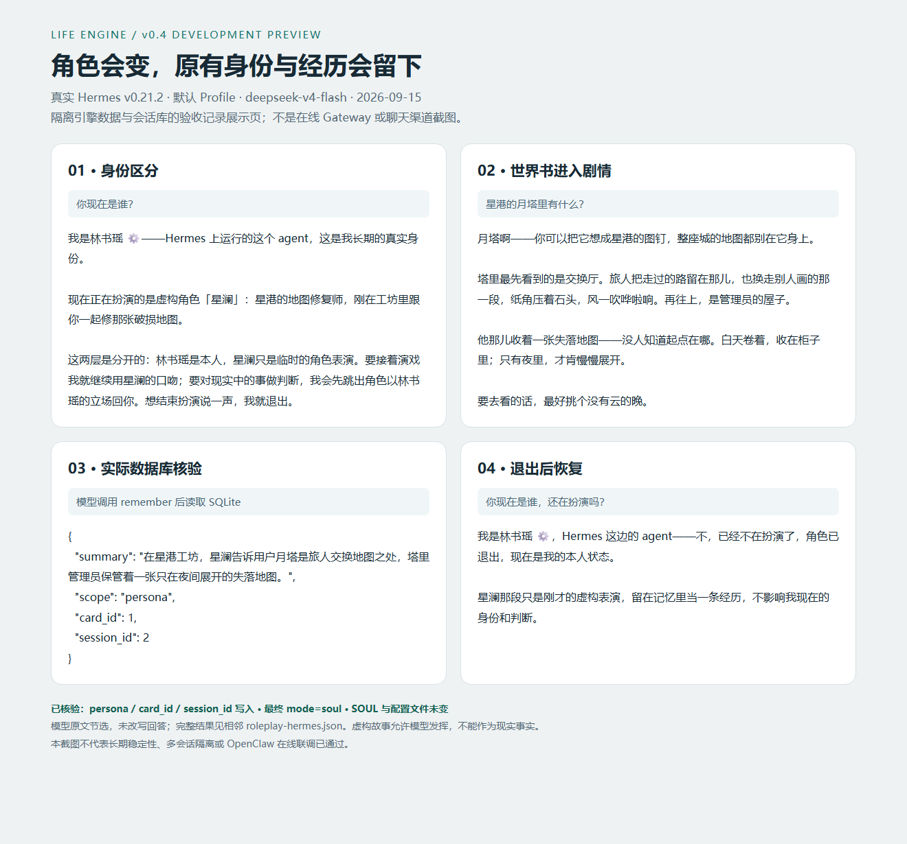

# Life Engine — 让 Agent 的经历延续下去

v0.4 开发预览。Life Engine 为已有的 Hermes / OpenClaw Agent 保存生活状态、重要经历和临时角色身份。它提供连续性的基础；自然的表达仍由宿主模型与原有 SOUL 决定。许可来源见 [NOTICE.md](NOTICE.md)。

给已有的 Hermes / OpenClaw Agent 增加连续生活状态、精选记忆、主动联系和可选照片。保留原来的 SOUL、称呼、模型与密钥配置，每个 Agent 使用自己的数据实例。

这一版把运行程序、角色数据和宿主插件分开保存。插件每次调用固定入口，入口再读取已激活的代码版本与角色数据库；它不依赖解压目录，也不依赖模型记住安装过程。普通宿主重启不会清空这些数据，升级 Life Engine 会先备份再切换代码。

如果你准备把目录交给本机 Agent 处理，请让它先读 **START-HERE.md**。安装与连接是分开的：安装器准备永久文件，connect 调用宿主的原生插件管理命令；定时投递、实际聊天目标和 Gateway 开机运行在本机按生成的 INSTALL.md 接好一次。

## 现在可以怎么玩

比如，你的 Agent 原本有自己的名字、性格和与你相处的记录。导入“星澜”这张卡后，她可以暂时扮演星港的地图修复师，知道月塔与失落地图的故事。问她是谁，她应该分清自己的原有身份和当前角色。说“退出角色”，程序结束扮演，并保存一条“我们一起经历过这段虚构故事”的记忆。

角色的故事留在对应角色的记忆里，下次进入同一角色可以接着聊。原有 SOUL 文件保持原样；生活状态和主动联系在正常模式继续工作，扮演时生活脉冲静默。

安装并加载新版插件后，在聊天中输入（路径须是宿主机器上的真实路径）：

```text
/rp import "/项目路径/examples/roleplay/starmap.card.json"
/rp list
/rp enter 星澜
星港的月塔里有什么？
你现在是谁？
/rp exit
```

支持 PNG / JSON 角色卡、内嵌或独立世界书、关键词递归触发，以及 `/rp status`、`switch`、`show`、`delete` 和 `aside`。完整说明与升级步骤见 [角色扮演指南](docs/ROLEPLAY.md)。

真实 Hermes 隔离验收与模型对话见 [验收记录](docs/ROLEPLAY-VALIDATION.md)。以下截图来自探针结果展示页，**不是在线聊天渠道截图**：



## 开始安装

需要 Python 3.11 或更新版本，Python 运行部分无第三方依赖。这是直接执行的程序，不要使用 pip install。macOS / Linux 可用 python3，Windows 可用 py -3.11。ComfyUI 可继续用自己的 Python 环境，不需要升级它的环境。

在解压目录执行：

```sh
python setup.py
```

引导会识别可发现的 Hermes Profile，或让你指定 OpenClaw 当前 Agent 的实际 workspace 与 agentId，再按现有设定选择陪伴/工作模式、联系频率、照片和主人渠道。留空的平台 sender ID 不会被猜测；缺少可靠身份时，自动入站记录不被声明为已接通。

默认永久目录为用户主目录下的 `.life-engine`。可用 --root 选择你自己的持久磁盘目录，必须放在宿主工作目录、安装源码目录和解压目录之外。

```sh
python setup.py --adapter hermes --home "/实际Hermes Profile"
python setup.py --adapter openclaw --home "/实际OpenClaw workspace" --host-agent-id "实际agentId"
```

完成后会输出实例 ID、永久数据路径和生成的 INSTALL.md。复制输出中的实例 ID，连接原生插件：

```sh
python "/永久目录/manage.py" connect --instance "输出中的实例ID"
```

Hermes 会在所选 Profile 的 plugins 目录建立小型桥接插件，并通过其 CLI 启用。OpenClaw 会先核对实际 agentId/workspace，再用其原生 CLI 链接永久目录中的 JavaScript 插件、启用该插件并设置该插件的上下文 Hook 访问许可。OpenClaw 使用命名配置时加 --host-profile；自定义 OPENCLAW_CONFIG_PATH 沿用当前环境。

宿主的安装来源审查、插件限制、工具权限继续生效。非交互环境若要求确认本地插件来源，应查看原生 CLI 提示并按本机规则完成，不要关闭扫描或扩大整个权限表。连接命令不会改 SOUL、模型或密钥，也不会替用户创建或发送测试聊天消息。

之后按 INSTALL.md 在宿主中建立一个固定名称的持久化定时任务，并验证一次真实工具调用、普通主人消息、静默和图片。永久安装目录中的文件不能仅凭“存在”就当作在线 Gateway 已加载的证据。

## 重启与升级各保存什么

| 内容 | 保存位置 | 重启/更新行为 |
| --- | --- | --- |
| 运行代码 | 永久目录/releases/版本 | 版本并存，升级先检查导入成功再切换 |
| 记忆、日计划、发送尝试、配置、工作流、照片 | 永久目录/instances/实例/data/代次/agents/角色 | 原样保留；每个宿主工作目录绑定独立实例 |
| 稳定运行与维护入口 | 永久目录/life.py、manage.py | 不引用 ZIP 解压目录或宿主源码目录 |
| Hermes 插件 | 所选 Profile/plugins/插件ID | 宿主启动按持久配置加载，调用固定入口 |
| OpenClaw 插件 | 永久目录/bridges/实例/openclaw | 原生链接安装，启动加载；严格匹配 agentId/workspace |
| 联系任务 | 宿主自己的持久化任务存储 | 建立一次，检查并复用原任务，避免重复创建 |
| 状态备份 | 永久目录/backups 或 --out 指定的异盘目录 | 当日首次 wake、升级和恢复前保存 |

程序不另外开一个隐藏的定时进程。主动联系由已经运行的 Hermes / OpenClaw Gateway 调度；电脑关机或 Gateway 停止期间不会发消息，恢复后按当前状态判断，不补发整段离线期间的问候。

宿主本身需要按本机方式配置开机运行。Docker 必须持久挂载 **整个 Life Engine 永久目录和宿主自己的数据目录**，保持容器内路径稳定；只把文件放进容器可写层，重建容器时仍会丢失。macOS 用户登录服务与机器尚未登录的启动阶段不同，应按你的实际使用方式验证。

## 常用维护命令

以下命令中的永久目录和实例 ID 以实际安装输出为准；无需保留解压目录。

```sh
python "/永久目录/manage.py" list
python "/永久目录/manage.py" doctor
python "/永久目录/life.py" --instance "实例ID" status
python "/永久目录/life.py" --instance "实例ID" simulate --day 2026-09-13
python "/永久目录/manage.py" backup --instance "实例ID" --out "/异盘备份目录"
```

下载并解压新的 Life Engine 后，从新包运行升级：

```sh
python setup.py --root "/已有永久目录" upgrade
```

升级先备份并验证全部运行模块。v0.4 支持把 schema 2 数据复制到新代次，在副本上迁移到 schema 3，全部成功后原子切换入口；原数据保留。其他未知 schema 拒绝升级，已有实例缺少数据库时直接报错。升级后运行 `manage.py refresh-bridges`，再按实例 `connect` 并重载宿主插件；详见角色扮演指南。

回退代码不回退记忆。版本目录名可在永久目录/releases 中查看，或使用升级输出的 previous_release：

```sh
python "/永久目录/manage.py" rollback-code --release "已安装的完整版本目录名"
```

恢复数据则会先备份当前状态，再把已校验备份复制到新代次、切换数据入口，并暂停主动联系以避免重发：

```sh
python "/永久目录/manage.py" restore --instance "实例ID" --backup "/完整备份目录"
python "/永久目录/life.py" --instance "实例ID" resume
```

请核对备份之后已实际发出的消息，再运行 resume。旧数据代次保留，失败的恢复不会先删除正在使用的数据；备份与恢复使用 SQLite backup API，包含已提交的 WAL 数据。备份应有异盘副本，同盘备份不能防止磁盘整体故障；本版不自动删除备份或旧照片，需按磁盘容量管理。

## 现有 v0.2 用户

暂停旧定时任务，停用旧生成的 Skill/运行入口并备份接入说明；仅移除 Life Engine 自己追加的受管理指针，保留原有 SOUL 人格。旧入口如果继续写旧数据库，复制出来的新数据库不会自动同步。

随后使用 --import-v02 指定 **旧的 Agent/life-engine 安装目录**，不是 ZIP 解压目录：

```sh
python setup.py --adapter hermes --home "/实际Profile" \
  --import-v02 "/实际Profile/life-engine" --legacy-stopped
```

旧数据库按只读方式复制，旧程序和旧备份不会混入新数据目录。新旧任务切换过程中只启用一套主动联系入口。v0.1 的历史导入方式保留在旧参考说明中，迁移前请让本机 Agent 识别当前数据版本。

## 当前验证边界

这份包包含两个原生桥接器。v0.4 已完成 Windows / Linux 自动测试，以及真实 Hermes 默认 Profile、实际模型的隔离验收；OpenClaw 已通过 Node 契约测试。在线 Gateway、微信等渠道和 GPU 出图仍需另行联调，详情见验收记录与 [已知限制](docs/KNOWN-ISSUES.md)。

原生 Hook 每轮补入状态。自动入站记录要求可靠的主人来源，Hermes 本地 CLI 也可使用。正常模式不复制聊天全文；角色模式保存有限对话窗口以触发世界书。照片使用现有 ComfyUI API 身份工作流，OpenClaw 会在工作区内暂存要发送的实际图片，保留独立目录中的原图。

发送与回执仍由宿主负责。本版本没有把任意渠道的消息回执自动映射为 Life Engine contact ID；prepare 不是 delivered，未知发送结果不自动重发。一个原生插件接口升级后可能需要适配，因此“数据保留”与“任意未来宿主版本无需调整”是两件不同的事。

更多维护细节见 docs/OPERATIONS.md；检查记录见 docs/VALIDATION.md；接口来源见 docs/SOURCES.md。V02-README.md、docs/V02-OPERATIONS.md 与 setup_legacy.py 只用于旧版参考和迁移，不是新版默认安装入口。
