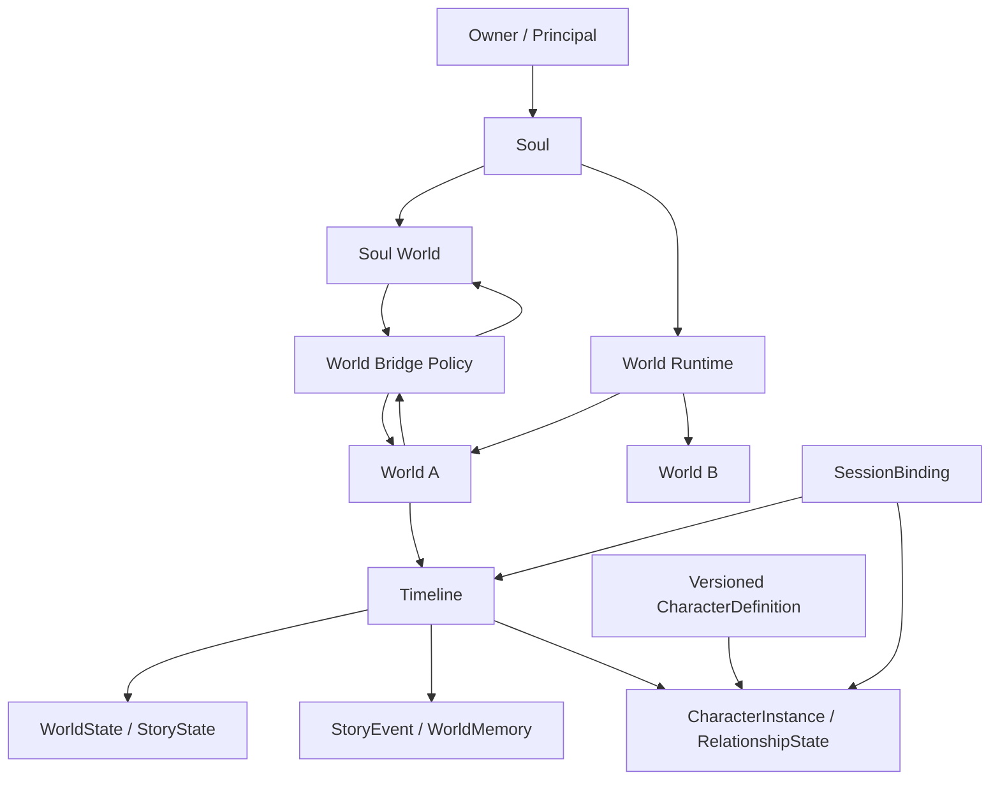

# SP-004 — Persistent World & Story Runtime Architecture Baseline

| 属性 | 值 |
| --- | --- |
| 类型 / 状态 | Architecture RFC / PROPOSED，待独立审核 |
| Owner / Independent Reviewer | Codex / ChatGPT（小雪） |
| 日期 | 2026-09-16 |
| Implementation Authorization | NOT AUTHORIZED |
| Merge Authorization | NOT AUTHORIZED |
| main baseline | `81ee02b561ac90641c3632f750ffd86a48310cf7` |
| PR #3 reviewed head | `ab227f2179eeaa7ded662d612508a98ad5cdf04a`，OPEN / DRAFT |

本文中的“必须”是建议未来实现满足的架构约束，不代表本轮已经实现或批准。没有新增数据库、Schema 或运行接口。配套文档：[Gap Analysis](SP-004-GAP-ANALYSIS.md)、[实施拆分](../planning/SP-004-IMPLEMENTATION-PLAN.md)、[检查记录](../planning/SP-004-QUALITY-GATES.md)。

## 1. Architecture Context / Current State

Life Engine 的目标是 Persistent Life / World Runtime for AI Agents。主动联系、角色扮演和世界书检索是其使用方式。持续性来自有归属、可验证、可恢复的数据与运行规则，不能只依赖宿主聊天上下文。

本次从最新 main 创建文档分支，没有以未合并 PR 的代码作为产品基线。main v0.3 的 `config.world` 是场景、日程、天气和视觉选项配置；`days` 是日期计划，`contacts` 是主动联系账本。它们不是多世界实体、故事引擎或统一世界时间线。`Engine._moment` 已把陪伴状态标成 `fictional_role_state`，不能将它迁移成“已经发生的现实事实”。参见固定版本的 [Engine](https://github.com/y19870785/life-engine/blob/81ee02b561ac90641c3632f750ffd86a48310cf7/runtime/life_engine/engine.py)、[Config](https://github.com/y19870785/life-engine/blob/81ee02b561ac90641c3632f750ffd86a48310cf7/runtime/life_engine/config.py)、[Store](https://github.com/y19870785/life-engine/blob/81ee02b561ac90641c3632f750ffd86a48310cf7/runtime/life_engine/store.py)。

PR #3 增加卡片原文与规范化字段、头像、世界书、角色会话和 `soul/persona` 记忆。退出保存摘要，再次进入同卡可读旧记忆；数据已超越临时聊天缓存。但活动状态仍由一条角色会话决定，世界书和记忆按 `card_id` 查询；独立 World / Story 对象不存在。参见 [Schema](https://github.com/y19870785/life-engine/blob/ab227f2179eeaa7ded662d612508a98ad5cdf04a/runtime/life_engine/rp_schema.py)、[Sessions](https://github.com/y19870785/life-engine/blob/ab227f2179eeaa7ded662d612508a98ad5cdf04a/runtime/life_engine/rp_sessions.py)、[Prompt](https://github.com/y19870785/life-engine/blob/ab227f2179eeaa7ded662d612508a98ad5cdf04a/runtime/life_engine/rp_prompt.py)。

## 2. Problem Statement

“Roleplay 是否只是 Soul 上的 Prompt Overlay？”需要分层回答：表现层目前是宿主 SOUL 上的临时角色上下文，数据层已有持久化、状态转换与隔离。因此不能简单推翻 PR #3；也不能把“保存卡片和几条摘要”等同于 Persistent World Runtime。

当前同卡多故事会混用角色记忆，同一 Profile 的所有会话共享活动角色；删除卡片会级联删除其 persona 历史。退出后保留历史，但没有可恢复的结构化故事进度、关系变化、世界时钟或未完成事件。未来必须让上下文成为世界状态的投影，而非世界状态的来源。

## 3. Design Principles / Proposed Decisions

以下为待审核的 ADR 候选，本文不把它们标为 Accepted。

| 决策 | 建议 | 代价与被拒绝的默认方案 |
| --- | --- | --- |
| D1 Soul vs Character | Soul 是长期身份，CharacterInstance 是世界内的运行角色 | 宿主仍需身份边界；拒绝用卡片覆盖 SOUL |
| D2 World as Persistence Boundary | World + Timeline 为故事状态和记忆隔离边界 | 增加显式 ID / 查询上下文；拒绝以卡名或会话 ID 代替世界 |
| D3 External Format Adapter | 外部卡片先映射版本化 IR | 需要映射诊断；拒绝将 SillyTavern 字段直接变为核心实体 |
| D4 Explicit World Bridge | 两个方向均执行可审计的最小权限策略 | 需要授权与撤销处理；拒绝直接共享记忆表或自动复制剧情摘要 |
| D5 Event + Projection | 已接受事件与当前投影原子提交，快照用于恢复 | 需要版本与重放约束；不采用全系统事件溯源，也不把所有聊天当事件 |
| D6 Default Suspension | 无显式调度授权的虚构世界挂起时不推进 | 降低自主模拟复杂度；不根据离线时长编造发生过的剧情 |

Soul World 的“现实关联”不意味着 Agent 有生物意义的真实生活。实际观测、用户陈述、模拟日程、虚构体验必须保留不同真实性标签。人格与“活人感”是体验目标，不是数据真伪判断标准。

## 4. Domain Model



Owner 是可认证的用户或部署主体；Soul 是身份实体，不是鉴权凭据。建议第一阶段单 owner、单 Soul、多个 World，不承诺多人共享世界。用户代表在虚构世界内也应是有明确 ID 的参与者，不把现实用户的关系状态直接复用到虚构世界。

标识建议：`owner_id, soul_id, world_id, timeline_id, character_definition_id, definition_version, character_instance_id, session_id, event_id`。它们应独立于 host 路径、显示名、卡片名和外部文件 ID。不是本轮 DDL；未来字段类型和索引由获授权的实施设计确定。

一个 Soul 有一个默认 Soul World，拥有或获授权访问多个 Roleplay World；一个 World 至少有一条主 Timeline。一条 Timeline 有多个角色实例、事件、记忆和故事线，多个先后 Session 可以进入同一条 Timeline。Session 是一次参与及其权限绑定，不是世界生命周期。一个 SessionBinding 只绑定一个世界、时间线和受控角色，切换产生新绑定及新的写入代次。

CharacterDefinition 是不可变的版本化设定模板，可以被多个 World Instance 使用；CharacterInstance 固定属于一个 World/Timeline，拥有当地状态、关系和经历。同名角色不等于同一实例；定义升级不能改写实例的历史。首版只读主 Timeline，但所有持久引用携带 `timeline_id`；未来分支可带 `parent_timeline_id/fork_event_id`，不预先复制或实现分支算法。

## 5. Data Ownership Matrix

“持久”表示未来应保存，并不表示已存在于当前数据库。真源是权威数据，不包括缓存、Prompt 或模型自述。Runtime writer 必须验证认证主体、资源权限、预期 revision 和写入代次。

| 对象 | Owner | Persistence | Lifecycle | Source of Truth | Mutation Authority | Isolation Boundary |
| --- | --- | --- | --- | --- | --- | --- |
| Soul | 用户/部署主体 | 持久身份引用与版本 | 独立于世界/会话 | 宿主管理的 SOUL 与获批身份记录 | Owner；Runtime 不覆盖宿主 SOUL | owner + soul |
| SoulMemory | Soul，Owner 控制 | 持久且可删 | 保留策略与撤销 | 带来源及 reality_status 的记录 | Soul writer；桥接须策略批准 | owner + soul + Soul World |
| World | Owner，关联 Soul | 持久根实体 | created/active/suspended/archived/deleted | World metadata 与 revision | 获授权管理命令 | owner + world |
| WorldState | World | 持久投影/快照 | 跟随 Timeline | 已接受事件及版本化投影 | Runtime reducer | owner + world + timeline |
| WorldTimeline | World | 持久逻辑时钟/顺序 | 活跃、冻结、归档 | event_seq / clock checkpoint | Runtime 时钟命令 | owner + world + timeline |
| StoryState | World/Timeline | 持久投影 | 故事开启至完成/归档 | 已接受 StoryEvent | Story reducer | world + timeline + story |
| StoryEvent | World/Timeline | 持久审计记录 | proposed/accepted/rejected；可纠正/依法删除 | 接受记录及 causation | 验证后的 command writer | owner + world + timeline |
| CharacterDefinition | Owner 的内容库 | 原始导入+版本化 IR | 导入、发布版本、弃用 | 固定版本 IR 与来源哈希 | Importer 提案，Owner 确认 | owner + definition + version |
| CharacterInstance | World/Timeline | 持久 | 创建、在场、离场、归档 | definition 引用与世界内状态 | World writer | world + timeline + instance |
| RelationshipState | World/Timeline | 持久投影 | 随事件变化 | 有向实体对关系事件 | reducer；模型只能提议 | world + timeline + actor pair |
| RoleplaySession | Owner 的会话主体 | 绑定与历史持久，lease 可过期 | enter/active/closed | SessionBinding / epoch / lease | 认证的 enter/exit 命令 | principal + world + timeline + session |
| WorldMemory | World/Timeline | 持久记录及可重建检索索引 | 策略保留/修订/删除 | 带来源的已接受记忆 | namespace writer | owner + world + timeline + audience |
| BridgeEvent | Owner 的桥接授权域 | 持久最小审计信息 | proposed/approved/applied/revoked/failed | grant revision + source/target refs | Policy evaluator + target writer | source 与 target 双侧 ACL |

世界内的 knowledge audience 还需要控制角色视角：世界中存在的事实，不必对所有 CharacterInstance 可见。WorldMemory 查询至少过滤世界、时间线和受众；Soul 元身份信息不等于角色可用知识。

## 6. World Runtime Lifecycle

命令与持久状态分开：CREATE/ENTER/RESUME/EXIT 是命令，ACTIVE/SUSPENDED 等是状态。RESUMED 是事件，不能作为第二种 ACTIVE 状态。

| 命令 | 前置条件 | 原子结果 | 时钟/写入策略 |
| --- | --- | --- | --- |
| CREATE | Owner 明确创建，或批准导入后建世界 | 创建 world、主 timeline、初始快照；CREATED | 不推进剧情，不建立隐式桥接授权 |
| ENTER | CREATED，资源授权通过 | 获取 timeline writer lease，建 session/epoch；ACTIVE | 从已提交状态读，开始接受命令 |
| SUSPEND | ACTIVE，先排空或拒绝在途写入 | 提交检查点、撤销 lease/epoch，关闭参与绑定；SUSPENDED | 虚构逻辑时间冻结 |
| RESUME | SUSPENDED，资源授权仍有效 | 读取检查点，验证版本，创建新 session/epoch；ACTIVE | 从旧游标继续，不重置剧情 |
| EXIT | 当前参与绑定有效 | 结束 session；最后一位参与者离开时 SUSPENDED；调用方切回 Soul World | 世界和故事保留；体验桥接另经策略提交 |
| ARCHIVE | CREATED 或 SUSPENDED；无 writer | ARCHIVED，只读；保留检索权限 | 不接受剧情写入或定时推进 |
| DELETE | 已归档、Owner 明确确认、依赖检查通过 | 先 tombstone，再按保留策略清理；DELETED | 取消任务/lease/索引；不删除其他世界定义 |

ARCHIVED 如需恢复，先执行显式 UNARCHIVE 至 SUSPENDED，再 RESUME；这是一项补充设计建议。DELETE 不由普通退出触发。删除关联世界记忆和投影；其他世界复用的 CharacterDefinition 不随之删除。原始包、备份副本和桥接派生记录必须列入删除清单，不能声称 tombstone 已物理抹除所有备份。

此表主要规定 Roleplay World。默认 Soul World 由 Soul 初始化流程建立，不允许用普通角色世界 DELETE/ARCHIVE 命令使默认身份失去归属；删除整个 Soul 或账户需要独立的数据删除/恢复流程。SoulWorld 内模拟状态与现实记录仍分别标记，不因为它是默认世界就放宽真实性要求。

活动参与绑定与后台世界执行分开。首版每条 Timeline 一个有效 writer lease；可持久保留多个世界，但用户只在所选世界进行前台互动。未来若授权自主运行，则后台持有独立授权 lease 和预算，不伪装为用户在线，也不自动向现实渠道发消息。Soul World 的现实观测时钟不会因退出虚构世界而停止；主动联系仍服从渠道与打扰策略，不因增加世界而扩大权限。

写入事务输入至少包含主体、world/timeline、session/epoch、expected_revision、idempotency_key、来源。验证后提交事件、状态投影、revision 和 outbox；超时重试读已有结果，同一个 key 不得造成第二个事件，key 相同而载荷不同拒绝。崩溃后回收失效 lease，恢复到最后提交点；晚到模型结果携带旧 epoch 时拒绝，不落到新世界或 Soul。

## 7. Persistent Story Runtime

建议引入 StoryState、StoryEvent、StoryArc、RelationshipState、WorldTimeline：

- StoryEvent 描述一个被接受的变化，含 actor/target、发生顺序、故事时间、记录时间、来源、causation、类型和 payload version。模型输出最初只是候选，不天然是 canon。
- StoryState 保存当前地点、进行中任务、未解决事件、关键物品等投影；StoryArc 表示可选的故事目标与阶段，不要求按剧本自动推进。
- RelationshipState 是世界内角色对的关系投影，保留触发事件、质性描述和不确定性；没有证据时不推导信任分数，更不把角色好感变成现实用户关系。
- WorldTimeline 使用单调 `event_seq` 排序，另存逻辑时间与 UTC 记录时间。并发事件以提交顺序定序，逻辑时间跃迁要有明确命令，不能用消息到达时间倒写故事历史。

示例：Day 1 的相遇、Day 2 的共同任务、Day 3 的关系变化分别成为接受事件；WorldState 记录任务尚未结束，StoryState 保留当前阶段。Day 10 再次进入时读取这些投影和引用的事件，不依赖原聊天窗口。挂起期间无授权事件则仍停留在 Day 3；现实过了七天不等于故事也过去七天。

自然对话不逐句入 canon。Runtime 对候选校验实体存在性、作用域、前置状态、权限和 revision；有矛盾或重大后果时要求用户决定，常规虚构细节可在 Owner 事先授予的叙事权限内接受。修正使用 supersedes/补偿事件与重建投影，不能悄悄改旧事实。未经接受的模型文字可保留为短期对话，不能驱动任务完成、现实发送或跨世界推广。

## 8. Memory Boundaries / World Bridge

隔离默认开启。`memory_scope` 说明归属域，`memory_type` 说明内容用途，`reality_status` 说明真实性；三者不能互相替代。建议的 reality_status 至少包括 `observed`、`user_reported`、`simulated`、`fictional`、`fictional_shared_experience`、`unknown`。来源标签不是事实验证；外部报道或用户陈述不能自动升级为 observed。

建议记忆携带 `world_id, timeline_id, source_world, source_event_id, memory_type, reality_status, audience, provenance, bridge_permission_ref`。桥接许可不是模型可填写的 `true`，而是经过认证的 grant 引用与版本。检索索引、摘要缓存、日志、导出和照片元数据都需要同样的边界；只在最终 Prompt 过滤已经太迟。

桥接流程：选择最小来源字段 → 校验来源读权限 → 创建可审阅载荷 → 校验目标写权限、许可版本和现实属性 → 在目标事务中写入带 lineage 的派生事件 → 记录结果。不要直接移动源记忆，不要让目标获得整个源数据库的读取权限。跨物理存储使用持久 outbox/inbox 与幂等 key；失败可重试、撤销可阻止未消费消息，不假定分布式全局事务。

Grant 应记录授权主体、source/target world、事件类别或具体 source ID、字段白名单、用途、目标受众、单次/持续、有效期、可接受变换及撤销版本。默认两个方向均 deny。可在 ENTER 时明确选择“退出后仅保存共同游玩的体验摘要”，形成受限持续许可；这仍是显式选择，不是 Roleplay 默认附赠权限。模型和角色卡都不能签发 grant。

许可不可传递：A → Soul 的许可不允许 Soul 再转发到 B，派生事件再次桥接必须重新校验原来源约束与目标授权。BridgeEvent 保留 lineage 并拒绝自动环路；摘要、翻译或虚构改编不能洗掉来源及 reality_status。真实观测状态仅由受信任来源和明确验证流程授予，不能由模型自行升级。

### Reality → Roleplay

用户说“允许把我今天去上海出差告诉星澜”：只批准这句话及必要的来源说明，不包括酒店、联系人、工作秘密或整个现实记忆集合。目标存为 `user_reported` 的桥接信息，注明现实来源；若改写成“远行”，标记为基于现实的虚构改编，不能隐瞒变换。没有许可，模型的相关联想也不能触发自动检索。

### Roleplay → Soul

许可允许时，导出“我们共同玩过星澜的地图故事”作为 `fictional_shared_experience`，保留源 World/Timeline 引用；剧情中的战斗、旅行、恋爱不能变成 `Real User Fact`。默认允许范围可以是纯参与体验、不含剧情细节，但也需先授权。Owner 决定是否允许它参与现实关系体验的回顾；关系数值不由虚构事件直接更新。

### 撤销、删除与 aside

撤销许可阻止后续桥接及尚未消费的事件；已应用派生记录通过 lineage 标记不可检索/删除，重建索引与摘要。备份恢复必须重新应用撤销/删除清单，防止已撤销内容复活；已发送到外部模型的内容不能保证撤回，界面须如实说明。

临时以 Soul 身份评价，不应把 Soul 数据塞入当前角色对话历史。建议隔离的 Soul context lane，只给原会话返回授权的评价结果；恢复角色时清理上下文缓存。若宿主不能隔离 SOUL 私密记忆、历史和工具结果，则必须报告 `isolation_capability=limited`，禁用私密跨域检索，不宣称强隔离。PR #3 的 `aside` 是近期 Soul 记忆读取，尚不是这套权限协议。

## 9. Character Model / External Content IR

Importer 负责格式识别和边界检查，返回版本化 IR、诊断、损失清单与来源哈希。原包作为不执行的溯源附件保存。建议：

| IR | 包含 | 不包含 |
| --- | --- | --- |
| Character IR | 定义 ID/版本、性格、背景、语气、示例、素材引用 | 世界实例进度、SOUL 覆盖、运行权限 |
| Lore IR | 知识条目、适用条件、优先级、受众、来源 | 已发生 StoryEvent、未验证现实事实 |
| World IR | 世界模板、初始设定、角色定义引用、时钟规则 | 自动创建的活动会话或桥接许可 |
| Story IR | 可选故事模板、初始目标和候选阶段 | 从 character scenario 自动认定的历史事件 |

SillyTavern Character Card V2/V3、PNG/JSON、World Book/Lorebook 都是 External Content Format。PR #3 解析器和关键词预算算法可复用，但要在 adapter 中产生内部 IR，不让外部 `position`、`extensions` 或卡片版本控制 Runtime 事务。World Book 名字含 World 不意味着它是可运行 World。

导入一张卡可生成 CharacterDefinition 提案；创建新世界、加入现有世界、采用哪些设定应分开选择。场景与 first message 仅为初始建议，不证明事件发生。遇到未知扩展要保留原文并明确诊断，可能改变语义的必需字段应拒绝或要求确认，不能静默声称全兼容。升级卡定义创建新版本，既有实例默认固定旧版本；改用新版需差异预览及兼容性检查。

## 10. Hermes / OpenClaw Boundary

```text
Hermes / OpenClaw / Other Host
  → Adapter: authentication, channel context, message normalization, capabilities
  → Runtime command/query envelope
  → Soul / World / Story / Memory / Scheduler policy
  → typed result / context projection / authorized delivery intent
  → Adapter: host prompt placement and actual delivery receipt
```

Domain ID 不能来自 `HERMES_HOME` 或 OpenClaw agentId；Binding Registry 将宿主身份映射到稳定的 principal/Soul。宿主迁移改变 binding，不改变 World 所有权。Runtime 不 import Hermes/OpenClaw SDK，事件只用通用来源类别和外部 reference。Adapter 不直接写领域表，不决定记忆真实性。

现有 [bridges.py](https://github.com/y19870785/life-engine/blob/ab227f2179eeaa7ded662d612508a98ad5cdf04a/runtime/life_engine/bridges.py) 已将大部分宿主 API 隔离在生成桥接器内，这是应保留的基础。泄漏主要在 [durable.py](https://github.com/y19870785/life-engine/blob/ab227f2179eeaa7ded662d612508a98ad5cdf04a/runtime/life_engine/durable.py)：instance ID 依赖 adapter/host 路径，state binding 耦合 host_home，context_text 选择宿主静默字符串，publish_photo 包含 OpenClaw 暂存逻辑。属于部署/表现层耦合，尚未发现 rp_sessions 直接依赖 Hermes SDK；不应夸大为全面 Hermes 绑定。

Scheduler 应输出获授权的世界推进命令或投递意图，宿主负责触发和渠道投递。世界事件提交不等于消息已发送，投递回执不等于剧情 canon。保留 contacts 的 prepare/ack 区别与幂等语义。强隔离需额外宿主契约测试：历史清理、scope 切换、同 Profile 多聊天、重试、晚到响应、重载与权限降级。

## 11. Persistence Strategy

建议继续使用现有持久根目录、SQLite 和不可变 release / 数据 generation；首版世界在同一 owner/Soul store 内逻辑分区，不立即改成每世界一个数据库。World 是逻辑隔离及迁移单元，不必等同物理文件。表、键和索引不在本 RFC 定稿，禁止本轮改 Schema。

未来使用带 owner/world/timeline 的复合约束或等价验证，拒绝混域引用；查询接口必须显式接收作用域，不能缺 ID 就回退全库搜索。事件记录、投影与 revision 在一个短事务提交；网络和 LLM 运行在事务外。快照包含 projector version、last event seq、源哈希；重建必须固定 reducer 版本，不能重放时再调用模型随机生成。

不把 Prompt、宿主消息历史、embedding 或最近 N 条摘要作为 Source of Truth。向量索引和 Prompt 均为可重建视图。备份覆盖原始导入、定义版本、世界/故事状态、事件、授权及删除清单；恢复到新 generation 验证校验和与约束，再切换入口，暂停外部副作用。保留策略要允许删敏感正文而保留最小非敏感 tombstone，不能以“事件不可变”为由永久保存所有私人文本。

## 12. Staged Migration Strategy

兼容基线分两条：main schema 2 的用户没有角色数据；PR #3 schema 3 是待合并候选，不应假定人人已有它。后续版本需要分别验证入口，未知 schema 仍拒绝自动重建。复用 PR #3 副本迁移、备份与原子指针切换机制，具体迁移脚本另行授权。

| 旧数据 | 目标映射提案 | 保留与歧义处理 |
| --- | --- | --- |
| agent config / memories / days / contacts | Soul + 默认 Soul World；原结构先保留 | origin=fictional_role_state 保留 simulated；无来源记忆标 unknown，不宣称全部真实 |
| CharacterCard | CharacterDefinition 固定版本 + 原始导入引用 | legacy card ID → 新 ID 映射表，不按名称合并 |
| WorldBook | Lore IR，先保留卡定义关联 | 不凭条目自动认定世界实体/历史 |
| 同一卡片的历史会话集合 | 一个隔离的 legacy World + 主 Timeline + CharacterInstance | 保持旧版同卡回忆语义；标 legacy_association，不宣称这些会话本来是同一故事 |
| RoleplaySession | SessionHistory + world/timeline/instance 绑定 | 原始时间、ID、摘要全保留；活动会话在明确维护窗口关停/挂起后迁移 |
| persona memory | WorldMemory，引用 legacy session/character | 不自动提炼为已接受 StoryEvent；StoryState 初始为 unresolved |
| roleplay_meta | SoulMemory 的 legacy fictional_shared_experience | 保留原文及来源；标 legacy_unreviewed，不能推断历史 bridge_permission |

分阶段：M0 盘点、备份、建立映射提案 → M1 副本 shadow read 与数量/哈希/隔离比对 → M2 用户确认旧会话分组，构建兼容视图 → M3 冻结写入、校验源 revision、原子切换 authoritative writer → M4 保留兼容读写适配与旧代次 → M5 经独立授权后退役旧布局。

保留旧 meta 属于原存储数据的迁移，不是重新批准跨世界交换；不重新推送、不生成推断授权、不把 legacy 摘要再次推广成现实知识。新桥接和新增派生摘要仍默认拒绝。

不盲目 dual-write。需要兼容旧 `/rp` 时，由一个 Runtime writer 写新真源并提供旧响应投影；只在语义唯一时支持卡名快捷进入，多世界存在歧义则要求选择。旧可执行文件不得直接写新库；切换前确认没有残留进程持有旧数据写权限。World-aware 服务故障时拒绝写入，不静默回退旧 writer。

兼容承诺是保留数据、可识别旧命令并给出明确结果，不是保留所有隐式权限。旧自动 meta 与无范围 aside 在新模型启用前须展示权限变化：用户明确 opt-in 后才可继续受限共享，否则返回可理解的权限提示，不创建伪造历史授权。这项行为收紧需独立审核与迁移说明，不能在升级时悄悄发生。

回滚：切换前失败只丢弃/保留未激活副本，源库和指针不变；切换后若没有新写入，可冻结并恢复旧指针。若已有新世界事件，先冻结并完整导出新 generation，不能用旧备份覆盖并宣称无损。回退旧代码只使用对应旧数据独立部署；新事件保留待兼容导入/人工协调，未支持的语义不可强行降级。回滚含停机与可能的功能暂不可用，不承诺任意版本无损双向转换。

迁移验收至少检查计数、内容哈希、FK、所有权、时间线分区、同卡多故事歧义、桥接默认 deny、重试幂等、进程崩溃与备份恢复后撤销仍有效。旧数据损失为零，未解析数据可以暂不进入新 canon。

## 13. Security / Isolation

最小权限以认证主体和资源作用域执行，模型声明的 world_id 不是授权。卡片、世界书、Prompt 和角色都不能提升权限。明确 `No Silent Promotion`：命名 scope=soul 不足以证明现实真实性；反向将全部 Soul memory 注入角色也不允许。

必须覆盖跨世界检索、角色可见性、宿主历史残留、工具结果缓存、embedding 混检、调试日志、备份、导出和媒体路径。禁止全局共享“最近记忆”缓存。模型结果提交前再次验证 session epoch；世界归档/删除立即失效权限。身份声明可以保留原有 SOUL 名称，但不意味着角色获知全部私密身份档案。

本架构不承诺凭提示消除所有模型混淆，也不把任务中的虚构表演包装成真实经历。需以数据、权限、宿主能力与输出评测分别验收。

## 14. Open Questions / Future Extensions

独立审核需确认：

1. 是否接受逻辑 World 分区先共用 SQLite，何时需要物理隔离？建议先逻辑分区并强制所有查询范围。
2. 是否允许显式 opt-in 的持续体验摘要许可？建议默认关闭，提供内容预览与撤销。
3. legacy 同卡会话是否暂归一个 legacy World？建议保留旧行为，但用户可在迁移前拆分故事，禁止猜测剧情连续性。
4. 宿主是否能提供隔离的 Soul/Roleplay context lane？能力不足时哪些功能必须禁用？建议禁止私密 aside 检索与跨域引用。
5. 虚构世界默认冻结还是后台推进？建议冻结；自主推进、现实提醒和费用预算分别授权。
6. 叙事 canon 的自动接受范围、敏感事件确认阈值与保留周期需产品决定，不在本轮写死。

未来扩展包括 Timeline Branching、多人共同世界、角色视角知识、离线世界执行与跨宿主迁移。ID 和事件 lineage 预留扩展空间，不意味着这些能力已经实现。先完成权限与持久边界，再扩展叙事丰富度。任何下一阶段均须独立审核及新的实施授权。
